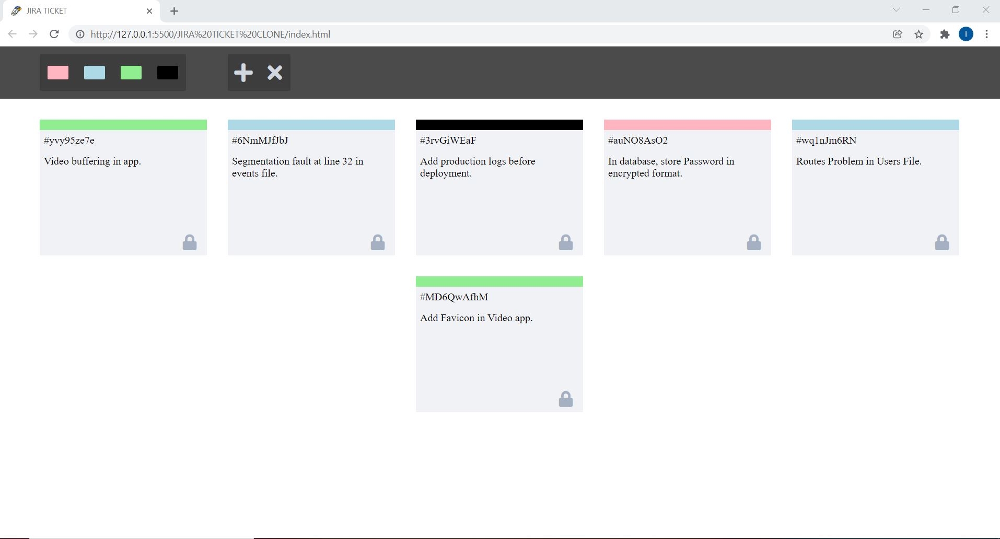
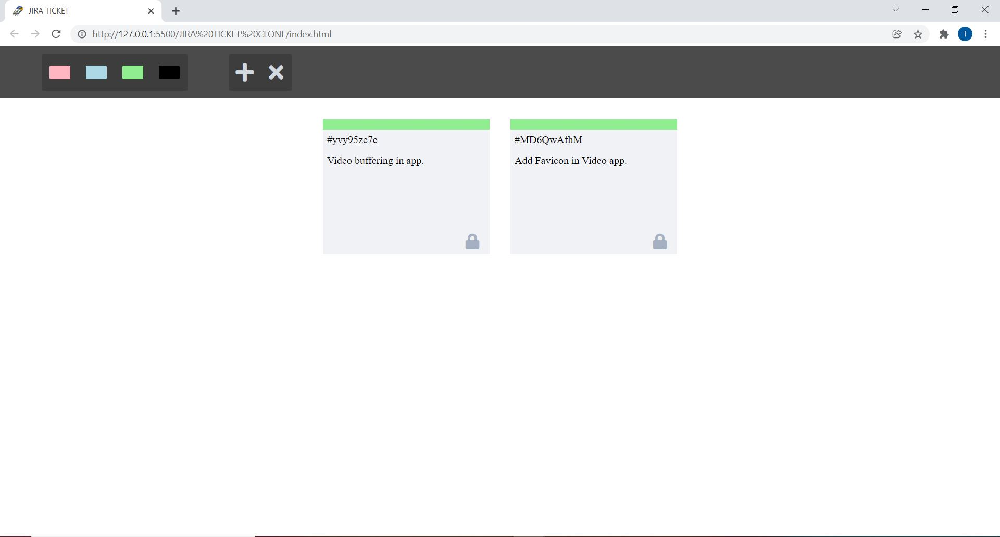
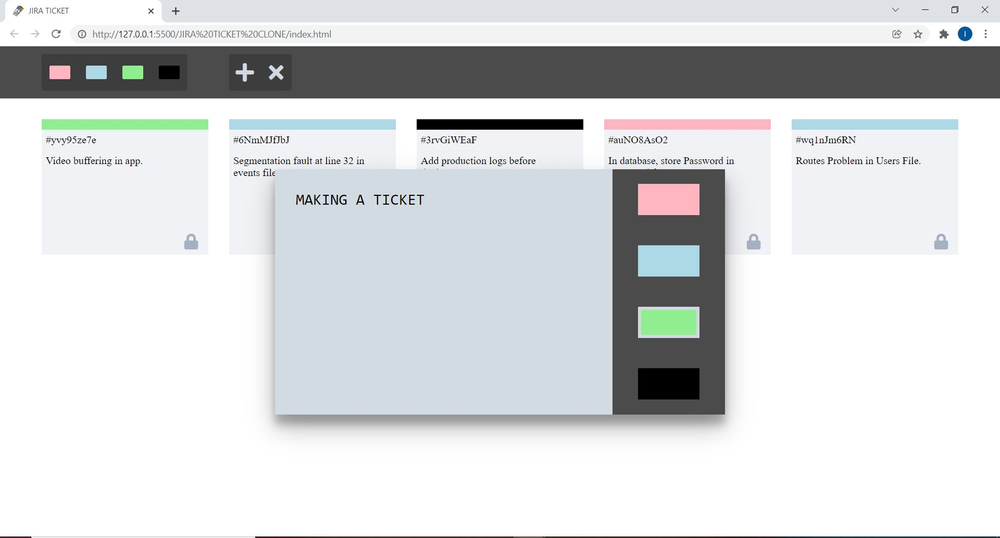
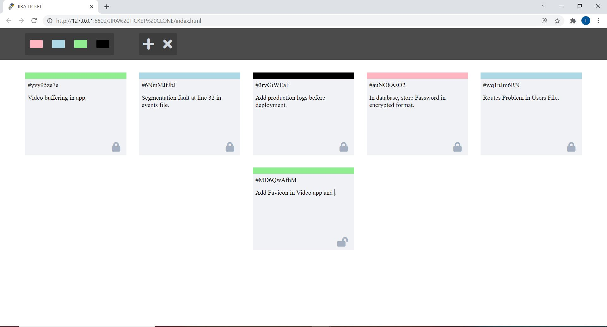

# Jira Ticket Management Clone

## Description
### Build Jira Ticket Management Clone with features :- 
- Adding new Tickets with Preferance Color.
- Filtering Tickets on the basis of colors.
- Edit Task in Tickets.
- Delete Tickets.
- Unique ID for every ticket.
- Storing Tickets in Local Storage of brower.

## Screenshots

#### All Tickets

#### Showing Tickets on Basis of colors

#### Making a new Ticket

#### Editing a Ticket

## Technologies Stack:

- HTML
- CSS
- Javascript
- Local Storage

### Insights
- Various DOM events such as click, double click, etc are used.
- Array of JSON objects are used to store data.
- Local storage API is used.
- Font Awesome icons is used.
- uuid is used for generating unique ids.

### How to install
- Clone the project onto your local machine.
- Open index.html file in browser.
- That's it now your own JIRA TICKET MANAGEMENT is ready for use.